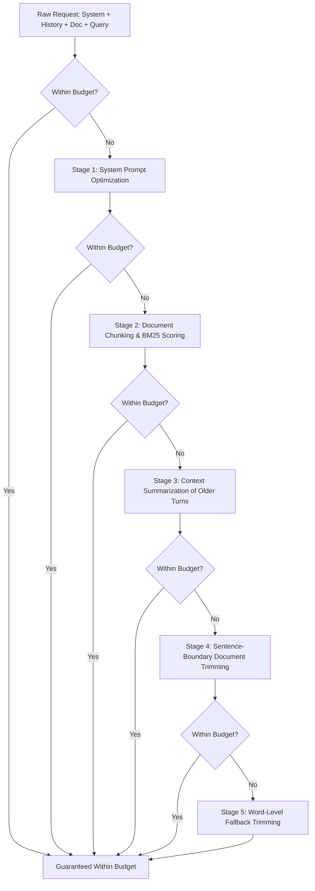

# 💰 CostCuttingLLM (TokenWise MCP)

> **Autonomous Token Optimization & Prompt Caching Toolkit for LLM Agents**  
> Cut your LLM token consumption and API costs by **50% to 90%** through intelligent prompt compression, RAG chunking, history summarization, and Anthropic prompt-cache breakpoint planning.

---

## 📌 Table of Contents
- [Overview](#-overview)
- [Key Features](#-key-features)
- [Benchmarks & Performance](#-benchmarks--performance)
- [Tech Stack Architecture](#-tech-stack-architecture)
  - [Frontend](#frontend)
  - [Backend & Engine](#backend--engine)
- [Core Logic & Algorithms](#-core-logic--algorithms)
  - [1. Smart Token Optimizer Waterfall](#1-smart-token-optimizer-waterfall)
  - [2. Anthropic Prompt Cache Breakpoint Planning](#2-anthropic-prompt-cache-breakpoint-planning)
  - [3. RAG Relevance Chunking](#3-rag-relevance-chunking)
  - [4. Rule-Based Phrase Pruning](#4-rule-based-phrase-pruning)
- [Getting Started](#-getting-started)
- [Connecting Your AI Agent](#-connecting-your-ai-agent)
- [Tool Reference](#-tool-reference)
- [Analytics Dashboard](#-analytics-dashboard)
- [License](#-license)

---

## 🚀 Overview

Modern AI agent loops, multi-turn chat applications, and RAG pipelines frequently waste **50% to 90%** of their token budget on:
1. Re-sending identical system prompts and tool definitions on every turn.
2. Ingesting whole 10,000-word documentation files to answer single questions.
3. Preserving verbose conversation history and filler phrases.

**CostCuttingLLM (TokenWise MCP)** provides a unified solution as both an **MCP Server** (compatible with Antigravity IDE, Claude Desktop, Claude Code, Cursor, Windsurf) and a **TypeScript Library** to automatically optimize, prune, and cache payloads before they reach expensive LLM APIs.

---

## ⚡ Key Features

| Tool | Capability | Typical Savings |
| :--- | :--- | :---: |
| **`plan_prompt_caching`** | Places Anthropic `cache_control` breakpoints on system prompts, tools, and message history | **50%–65%** |
| **`chunk_document`** | Slices large documents and extracts only query-relevant sections for RAG | **70%–90%** |
| **`smart_token_optimizer`** | Automatically cascades multiple optimization techniques to strictly fit any token budget | **Fits Budget** |
| **`compress_prompt`** | Eliminates filler phrases and verbose conversational fluff | **10%–30%** |
| **`summarize_context`** | Condenses older turns in long conversations while preserving recent turns verbatim | **20%–40%** |
| **`optimize_system_prompt`**| Converts wordy instructions into compact bullet directives | **15%–40%** |
| **`cache_context`** | Persists unchanging schemas, rules, and boilerplate to local disk | **100% on repeat** |
| **`estimate_tokens`** | Offline token counter and pricing estimator for Claude, OpenAI, DeepSeek, and Llama | Cost Insight |
| **`get_stats`** | Tracks daily, session, and cumulative tokens and cost saved | Analytics |

---

## 📊 Benchmarks & Performance

Measured using real multi-turn agent benchmarks:

| Scenario | Optimization Strategy | Result |
| :--- | :--- | :---: |
| **10-Turn Agent Loop** (`claude-3-5-sonnet`) | System Prompt + 16 Tool Defs + Cached Message Prefixes | **61.9% Cost Cut** ($0.0994 ➔ $0.0379) |
| **RAG Retrieval** (9,000-token doc) | Keyword/embedding relevance chunking (top-3 chunks) | **93.1% Token Cut** (9,001 ➔ 617 tokens) |
| **Multi-Turn Context Compression** | 9-message conversation condensed to 3 messages | **28.9% Token Cut** (481 ➔ 342 tokens) |

---

## 🛠️ Tech Stack Architecture

### Frontend
- **Zero-Dependency Web Stack**: Built with semantic **HTML5**, modern **CSS3**, and **Vanilla JavaScript** (no heavy frameworks like React/Vue).
- **Dynamic Server-Rendered SVG**: The analytics dashboard computes and generates dynamic SVG bar charts and meter visualizers directly in Node.js without client-side charting libraries.

### Backend & Engine
- **Runtime**: Node.js (v18+) with TypeScript 5.5 (`strict: true`, target `ES2020`).
- **Protocol**: **Model Context Protocol (MCP)** using `@modelcontextprotocol/sdk` (v1.12.1) communicating over **`stdio`** (`StdioServerTransport`).
- **Tokenization**: `tiktoken` (v1.0.17) for offline Byte-Pair Encoding (BPE) counting across `cl100k_base` and model-specific encodings.
- **Embedded Web Server**: Native Node.js `http` module powering the local analytics dashboard on port `4317`.
- **Storage & State**: File-system persistence (`fs` / `path`) storing namespace-isolated JSON files in `~/.tokenwise/{cache,usage,proactive}/`.
- **Cryptography & Security**: Native Node.js `crypto` for offline verification of perpetual digital license keys.
- **Containerization**: Multi-stage `Dockerfile` and `docker-compose.yml` based on `node:20-alpine`.

---

## 🧠 Core Logic & Algorithms

### 1. Smart Token Optimizer Waterfall
The `smartTokenOptimizer` takes a user query, document, system prompt, conversation history, and a target `maxTokens` budget, applying a deterministic multi-stage waterfall:



### 2. Anthropic Prompt Cache Breakpoint Planning
Anthropic models (`claude-3-5-sonnet`, `claude-3-opus`) offer a **90% discount on input tokens** that hit prompt caches, requiring:
- A minimum block size of **1,024 tokens** (2,048 for Haiku).
- A maximum of **4 cache breakpoints** (`cache_control: { type: "ephemeral" }`).

The algorithm in `src/utils/promptCache.ts`:
1. Checks if the **System Prompt** meets the token minimum. If yes, attaches breakpoint 1.
2. Serializes and calculates token size for **Tool Definitions**. If `system + tools >= 1024`, marks the final tool definition with breakpoint 2.
3. Analyzes **Conversation History** to identify stable prefixes (prior user/assistant turns) and places breakpoints 3 & 4 on older stable turns while leaving the newest user prompt uncached.

### 3. RAG Relevance Chunking
Implemented in `src/utils/embeddingMatcher.ts` & `src/tools/chunkDocument.ts`:
- Tokenizes the query into significant keywords (stripping common stopwords).
- Partitions large documents into fixed-size word chunks with sliding overlaps.
- Computes Term Frequency / Keyword overlap scores for each chunk against the query.
- Returns only the top $N$ highest-scoring chunks, cutting unneeded context by up to 93%.

### 4. Rule-Based Phrase Pruning
Implemented in `src/utils/textCompressor.ts`:
- Employs deterministic regex replacements to eradicate filler words without modifying intent:
  - `in order to` ➔ `to`
  - `due to the fact that` ➔ `because`
  - `please be advised that` ➔ ` `
  - `it is important to note that` ➔ `note:`
  - Strips AI conversational openers (`"Sure! I'd be happy to help..."`).

---

## 📦 Getting Started

### 1. Installation
Clone the repository and install dependencies:
```powershell
cd -tokenwise-mcp
npm install
```

### 2. Build TypeScript
```powershell
npm run build
```

### 3. Run Test Suite
Verify that all 7 optimization tools work end-to-end:
```powershell
node test.mjs
```

---

## 🔌 Connecting Your AI Agent

### Option 1: In Antigravity IDE / Gemini IDE
Create `.agents/mcp_config.json` in your workspace root:
```json
{
  "mcpServers": {
    "tokenwise": {
      "command": "node",
      "args": [
        "c:/Users/hp/Downloads/-tokenwise-mcp/-tokenwise-mcp/dist/server.js"
      ]
    }
  }
}
```

### Option 2: In Claude Desktop
Add to `%APPDATA%\Claude\claude_desktop_config.json`:
```json
{
  "mcpServers": {
    "tokenwise": {
      "command": "node",
      "args": [
        "c:/Users/hp/Downloads/-tokenwise-mcp/-tokenwise-mcp/dist/server.js"
      ]
    }
  }
}
```

### Option 3: In Custom TypeScript / Node.js Agents
Import optimization functions directly without MCP subprocess overhead:
```typescript
import Anthropic from "@anthropic-ai/sdk";
import { planCacheBreakpoints, chunkDocument, compressPrompt } from "./-tokenwise-mcp/dist/index.js";

const client = new Anthropic();

async function askAgent(query: string, history: any[], referenceDoc: string) {
  const { chunks } = chunkDocument(referenceDoc, query, 2, 500);
  const { compressed } = compressPrompt(query, "medium");

  const messages = [
    ...history,
    { role: "user", content: `Context:\n${chunks.join("\n\n")}\n\nTask: ${compressed}` }
  ];

  const plan = planCacheBreakpoints({
    system: "You are a senior full-stack AI engineer.",
    messages: messages,
    model: "claude-3-5-sonnet"
  });

  return await client.messages.create({
    model: "claude-3-5-sonnet-20241022",
    max_tokens: 1500,
    system: plan.system,
    messages: plan.messages as any
  });
}
```

---

## 📈 Analytics Dashboard

Track your real-time token savings and cost reductions:

```powershell
npm run dashboard
```
Open **[http://localhost:4317](http://localhost:4317)** in your browser:
* Visual SVG bar chart showing daily savings over the last 7 days.
* Breakdown of savings by individual tool.
* Cumulative cost reductions across all sessions.

---

## 📄 License
MIT / Perpetual Offline License during Beta. See [LICENSE](file:///-tokenwise-mcp/LICENSE) for details.
