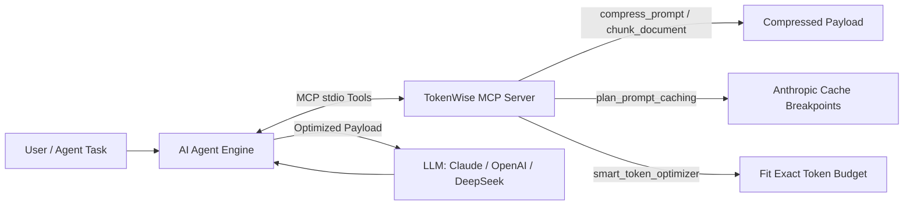

# TokenWise MCP: AI Agent Integration & Usage Guide

`tokenwise-mcp` is a specialized Model Context Protocol (MCP) server and TypeScript toolkit designed to reduce LLM token consumption and API costs by **50% to 90%**.

It achieves this through:
- **Anthropic Prompt Cache Breakpoint Planning** (`cache_control: { type: "ephemeral" }`)
- **Semantic & Keyword Document Chunking** for RAG pipelines
- **Conversation History Summarization**
- **System Prompt and User Prompt Compression**
- **Smart Budget-Driven Token Optimization**
- **Zero-Dependency Usage Dashboard**

---

## 1. Prerequisites & Build

Before connecting any AI agent, ensure dependencies are installed and the TypeScript project is compiled:

```powershell
cd c:\Users\hp\Downloads\-tokenwise-mcp\-tokenwise-mcp
npm install
npm run build
```

This generates the server entrypoint at:
`c:\Users\hp\Downloads\-tokenwise-mcp\-tokenwise-mcp\dist\server.js`

---

## 2. Architecture: How an AI Agent Uses TokenWise MCP



---

## 3. Connecting to IDEs and Desktop AI Agents

### A. Antigravity IDE / Gemini IDE
Add this server to your workspace `.agents/mcp_config.json` or global IDE config:

```json
{
  "mcpServers": {
    "tokenwise": {
      "command": "node",
      "args": [
        "c:/Users/hp/Downloads/-tokenwise-mcp/-tokenwise-mcp/dist/server.js"
      ]
    }
  }
}
```

### B. Claude Desktop
Add to `%APPDATA%\Claude\claude_desktop_config.json`:

```json
{
  "mcpServers": {
    "tokenwise": {
      "command": "node",
      "args": [
        "c:/Users/hp/Downloads/-tokenwise-mcp/-tokenwise-mcp/dist/server.js"
      ]
    }
  }
}
```
*Restart Claude Desktop to load the tools.*

### C. Claude Code CLI
Run:
```bash
claude mcp add tokenwise node c:/Users/hp/Downloads/-tokenwise-mcp/-tokenwise-mcp/dist/server.js
```

#### Optional: Enable Proactive Mode
To have Claude proactively use TokenWise (e.g., chunking large docs automatically instead of dumping full files into context):
```bash
npx tokenwise-mcp setup
```

### D. Cursor / Windsurf / VS Code (Cline / Roo Code)
Add an MCP server in settings:
- **Type / Transport**: `stdio`
- **Command**: `node`
- **Arguments**: `["c:/Users/hp/Downloads/-tokenwise-mcp/-tokenwise-mcp/dist/server.js"]`

---

## 4. Connecting a Custom Programmatic AI Agent

If you are writing your own agent in TypeScript or Python, you can integrate with TokenWise directly:

### Option A: Using as a Direct TypeScript Library (Fastest)

No MCP subprocess overhead needed — import functions directly:

```typescript
import Anthropic from "@anthropic-ai/sdk";
import { 
  chunkDocument, 
  compressPrompt, 
  planCacheBreakpoints,
  smartTokenOptimizer 
} from "c:/Users/hp/Downloads/-tokenwise-mcp/-tokenwise-mcp/dist/index.js";

const client = new Anthropic();

async function runAgentTurn(userQuery: string, history: any[], largeKnowledgeDoc: string) {
  // 1. Only pull relevant chunks of the large doc (70-90% token savings)
  const { chunks } = chunkDocument(largeKnowledgeDoc, userQuery, 3, 500);
  const context = chunks.join("\n\n---\n\n");

  // 2. Compress verbose prompt instructions (10-30% token savings)
  const { compressed } = compressPrompt(userQuery, "medium");

  const messages = [
    ...history,
    { role: "user", content: `Context:\n${context}\n\nTask: ${compressed}` }
  ];

  // 3. Automatically place Anthropic Prompt Cache breakpoints (up to 90% discount on cache hits)
  const cachePlan = planCacheBreakpoints({
    system: "You are an autonomous engineering agent.",
    messages: messages,
    model: "claude-3-5-sonnet",
  });

  // 4. Send the cost-optimized request to the model
  const response = await client.messages.create({
    model: "claude-3-5-sonnet-20241022",
    max_tokens: 1500,
    system: cachePlan.system,
    messages: cachePlan.messages as any,
  });

  return response.content;
}
```

### Option B: Connecting from Python via MCP Client SDK

If your agent is written in Python (e.g., LangChain, LlamaIndex, or custom loop):

```python
import asyncio
from mcp import ClientSession, StdioServerParameters
from mcp.client.stdio import stdio_client

server_params = StdioServerParameters(
    command="node",
    args=["c:/Users/hp/Downloads/-tokenwise-mcp/-tokenwise-mcp/dist/server.js"]
)

async def run_agent_with_mcp():
    async with stdio_client(server_params) as (read, write):
        async with ClientSession(read, write) as session:
            await session.initialize()
            
            # List available tools
            tools = await session.list_tools()
            print("Connected tools:", [t.name for t in tools.tools])
            
            # Call smart_token_optimizer tool
            result = await session.call_tool(
                "smart_token_optimizer",
                arguments={
                    "systemPrompt": "You are a helpful assistant with extensive guidelines...",
                    "messages": [{"role": "user", "content": "How do I optimize database queries?"}],
                    "document": "Long documentation about indexing, query plans, and sharding...",
                    "query": "How do I optimize database queries?",
                    "maxTokens": 1000
                }
            )
            print("Optimized Result:", result.content)

asyncio.run(run_agent_with_mcp())
```

---

## 5. Tool Reference & When Agents Should Call Them

| Tool Name | When Your Agent Should Use It | Typical Savings |
|---|---|---|
| `smart_token_optimizer` | **All-in-one budget enforcer:** pass `systemPrompt`, `messages`, `document`, `query`, and `maxTokens`. It automatically coordinates compression, chunking, and summarization to guarantee the prompt stays inside budget. | Fits any budget |
| `plan_prompt_caching` | Before making an Anthropic API call with large system prompts, tool definitions, or multi-turn agent conversations. Annotates headers with `cache_control: { type: "ephemeral" }`. | 50%–65% cost cut |
| `chunk_document` | Before feeding a massive document (API docs, PDF text, codebase files) to answer a specific query. Extracts top $N$ most relevant chunks. | 70%–90% |
| `compress_prompt` | When user input or tool output contains redundant fillers ("In order to...", "Please be advised..."). | 10%–30% |
| `summarize_context` | In long multi-turn conversations exceeding context window limits. Keeps recent messages intact and condenses past history. | 20%–40% |
| `optimize_system_prompt` | Converts verbose prose developer prompts into compact bullet directives. | 15%–40% |
| `cache_context` | Local disk key-value storage (`set`, `get`, `list`, `delete`) to store persistent rules or schemas across sessions. | 100% on repeat data |
| `estimate_tokens` | Checks exact or approximate tokens and estimated cost across GPT-4o, Claude, DeepSeek, etc. | Cost estimation |
| `get_stats` | Displays cumulative tokens saved, daily breakdown, and license status. | Monitoring |

---

## 6. Testing & Monitoring Token Savings

### 1. Run the End-to-End Test Suite
Verify all tools function properly on your machine:
```powershell
node c:\Users\hp\Downloads\-tokenwise-mcp\-tokenwise-mcp\test.mjs
```

### 2. Launch the Visual Analytics Dashboard
Run the dashboard server to track token savings and costs:
```powershell
cd c:\Users\hp\Downloads\-tokenwise-mcp\-tokenwise-mcp
npm run dashboard
```
Open **[http://localhost:4317](http://localhost:4317)** in your browser to view:
- Daily token savings bar charts
- Tool-by-tool breakdown
- Total cumulative cost reduction
